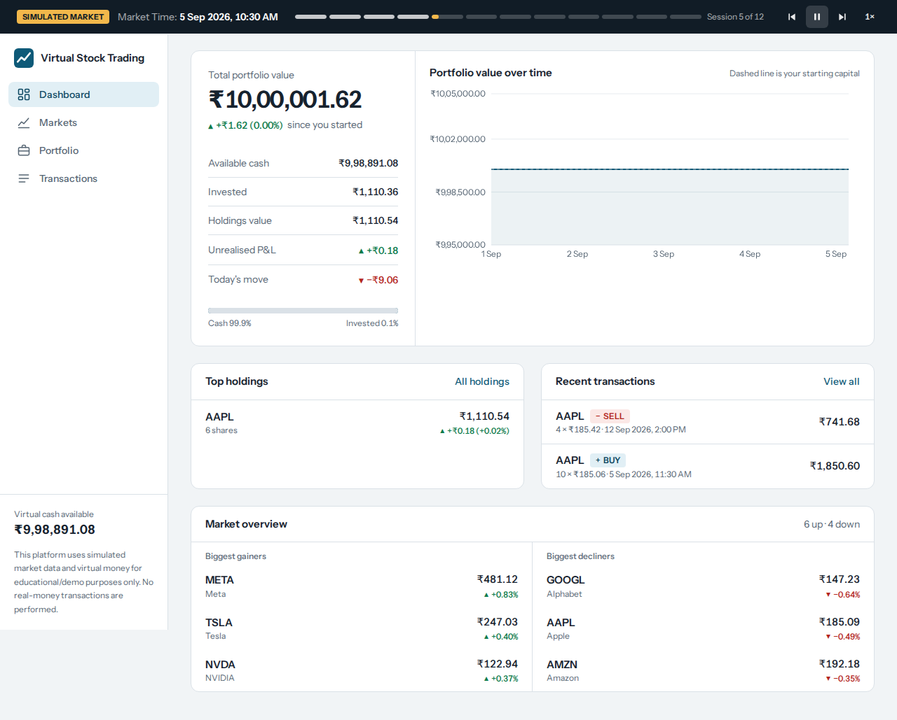
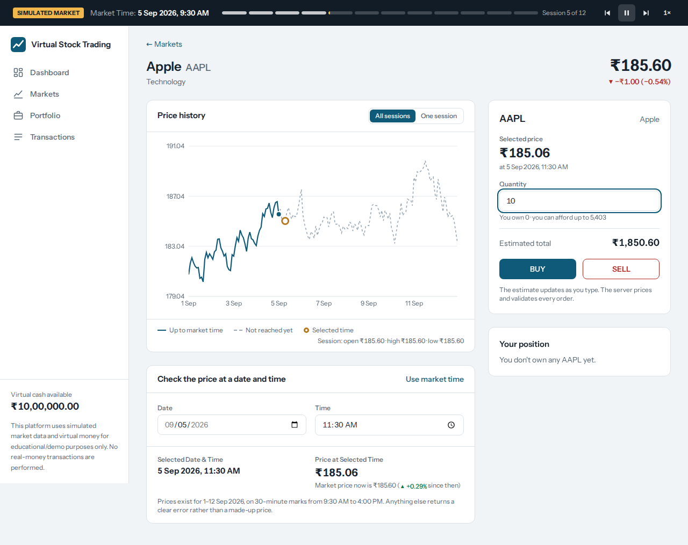
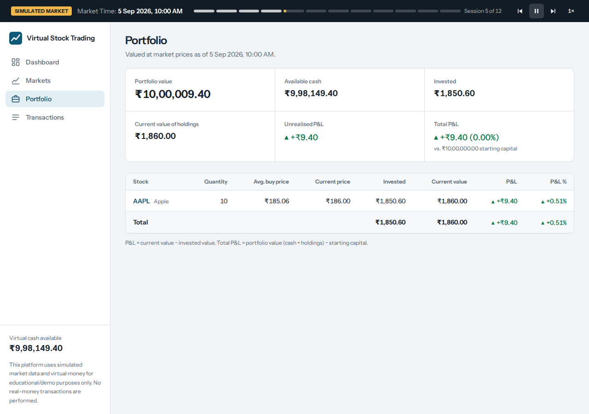
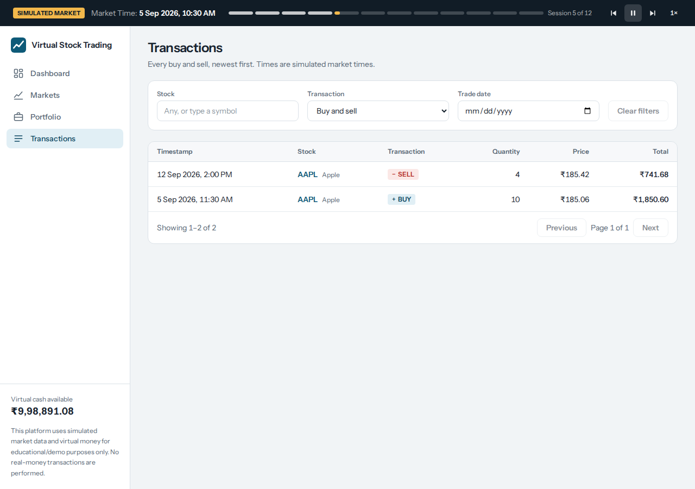
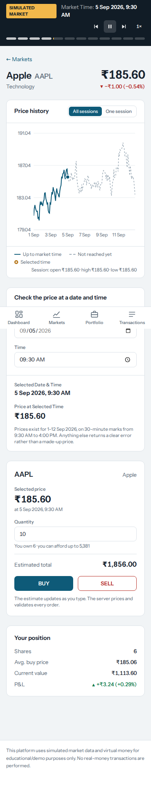

# Virtual Stock Trading Platform

An educational stock-trading simulator. One predefined user trades **virtual money (₹10,00,000)** against **generated, fictional market data**. There are no real-money transactions, payments, logins or brokerage integrations.

> This platform uses simulated market data and virtual money for educational/demo purposes only. No real-money transactions are performed.

## Features
- 10 stocks with 30-minute prices over 12 trading days (1,680 rows), imported from CSV into PostgreSQL
- Price lookup for any selected date and time (exact match only; a clear error otherwise)
- BUY / SELL with virtual cash, validated entirely on the backend (price always comes from the database)
- Portfolio with average buy price, unrealised P&L, total P&L and a performance chart
- Filterable, paginated transaction history (newest first)
- Simulated market clock (play / pause / step) that advances prices and valuation
- Loading, empty and error states, toasts, sell confirmation, responsive layout

## Tech stack
React + Vite + TypeScript + Tailwind CSS + Recharts + Axios · FastAPI + SQLAlchemy + Pydantic · PostgreSQL

## Architecture
`React (frontend) → FastAPI REST API (backend) → PostgreSQL`

## Market data
`backend/data/market_data.csv` is produced by `backend/scripts/generate_market_data.py` (deterministic, seeded). Columns: `symbol,name,timestamp,price`. The simulated market trades on 12 consecutive days, 2026-09-01 to 2026-09-12, 09:30–16:00 every 30 minutes. The data is entirely fictional.

Example: `/api/stocks/AAPL/price?date=2026-09-05&time=11:30`. Any other date or time returns a clear 404 (prices are never invented).

## Database schema
`stocks` (symbol, name, sector) · `market_data` (stock_id, timestamp, price; unique on stock_id + timestamp) · `user_account` (name, initial_balance, cash_balance) · `holdings` (stock_id, quantity, average_buy_price) · `transactions` (stock_id, BUY/SELL, quantity, price, total_amount, timestamp). Foreign keys and indexes are defined in `backend/app/models/entities.py`.

## Setup
```bash
git clone <repository-url>
cd virtual-stock-trading

# 1. PostgreSQL
createdb -U postgres virtual_trading   # the app creates the tables for you via migrations

# 2. Backend
cd backend
cp .env.example .env        # edit DATABASE_URL if needed
python -m venv .venv && source .venv/bin/activate
pip install -r requirements.txt
python seed_database.py                   # runs Alembic migrations, then seeds stocks, prices, account
uvicorn app.main:app --reload --port 8000

# 3. Frontend (new terminal)
cd frontend
cp .env.example .env
npm install
npm run dev                               # http://localhost:5173
```
Re-seed from scratch (wipes trades): `python seed_database.py --reset` (`scripts/seed_database.py` is the same script). API docs: http://localhost:8000/docs

## Database migrations
Schema changes are managed with Alembic (`backend/alembic/`, initial revision `0001`). `python seed_database.py` applies them automatically. To run them yourself:
```bash
cd backend
alembic upgrade head        # create / update the schema
alembic downgrade base      # remove it
alembic revision --autogenerate -m "describe change"   # after editing app/models
```
The tests build their own schema in a separate `<database>_test` database.

## Tests
```bash
cd backend && python -m pytest -q
```
Tests run against a separate `<database>_test` PostgreSQL database (override with `TEST_DATABASE_URL`).

## API
| Method | Path | Purpose |
|---|---|---|
| GET | `/api/stocks` | All stocks with latest price |
| GET | `/api/stocks/{symbol}` | Details, change, change % |
| GET | `/api/stocks/{symbol}/history?start=&end=` | Historical prices |
| GET | `/api/stocks/{symbol}/price?date=YYYY-MM-DD&time=HH:MM` | Exact price at a moment |
| POST | `/api/trade/buy`, `/api/trade/sell` | `{symbol, quantity, timestamp}` |
| GET | `/api/portfolio`, `/api/portfolio/performance` | Holdings, value, P&L, value over time |
| GET | `/api/transactions?symbol=&type=&date=` | History, newest first |
| GET | `/api/market/timeline` | Market timestamps for the simulation clock |

## Trading logic
- **BUY:** total = quantity × database price; rejected if total > cash. Cash decreases, the holding is created or its average buy price re-weighted, and one BUY transaction is written, all in one database transaction.
- **SELL:** rejected if quantity > shares owned (no short selling). Cash increases, the holding shrinks or is removed at zero, and one SELL transaction is written.
- **Valuation:** invested = avg buy price × qty; current = latest price × qty; unrealised P&L = current − invested; P&L % = P&L / invested × 100 (0 when invested is 0). Portfolio value = cash + holdings value; total P&L = portfolio value − ₹10,00,000.

## Screenshots
| Dashboard | Stock details (price at selected date/time, trade panel) |
|---|---|
|  |  |

| Portfolio | Transactions |
|---|---|
|  |  |

Mobile: 

## Demo video
_Add link here._

## Disclaimer
Simulated market data and virtual money only, for educational/demo purposes. No real-money transactions are performed.
